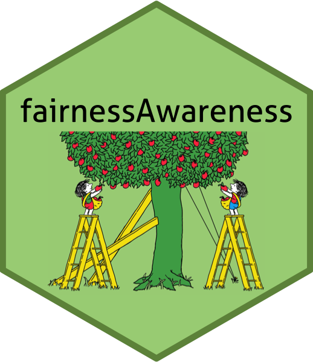

# Fairness Awareness: Prerequisites
Theo Bakker, The Hague University of Applied Sciences
2025-02-24

This <a
href="https://community-data-ai.npuls.nl/groups/view/44d20066-53a8-48c2-b4e9-be348e05d273/project-center-for-educational-data-analytics-ceda"
target="_blank">Npuls CEDA</a> 🔗 project makes it possible
to create a fairness analysis to study equity (*kansengelijkheid*)
within progression of students in educational institutions in The
Netherlands (mbo, hbo, and wo).

## 🎓 About

This project is a template for creating a **fairness analysis of
students’ progression in educational institutions in The Netherlands**.
The template is based on the
<a href="https://quarto.org/docs/get-started/"
target="_blank">Quarto</a> 🔗 framework and uses the
<a href="https://www.tidyverse.org/" target="_blank">Tidyverse</a>
🔗 coding standard. The template is developed by the <a
href="https://www.dehaagsehogeschool.nl/onderzoek/lectoraten/learning-technology-analytics"
target="_blank">Learning Technology &amp; Analytics (LTA)</a>
🔗 research group of The Hague University of Applied Sciences
for the <a
href="https://community-data-ai.npuls.nl/groups/view/44d20066-53a8-48c2-b4e9-be348e05d273/project-center-for-educational-data-analytics-ceda"
target="_blank">Npuls CEDA</a> 🔗 project project.

## 🚀 Getting started

These instructions will allow you to install a repository of the project
on your local machine to get up and running quickly at the workshop on
March 10.

### Prerequisites

To start working with this project, make sure you have the following
software installed on your local machine following the links provided:

**R, Rstudio, Quarto, XQuartz (for Mac only)**

- RStudio version 2024.12.0 or higher with R version 4.4.2 or higher -
  <a href="https://posit.co/download/rstudio-desktop/"
  target="_blank">Posit</a> 🔗
- XQuartz 2.8.5 or higher (for Mac only) -
  <a href="https://www.xquartz.org/" target="_blank">XQuartz</a>
  🔗
- Quarto version 1.6.39 or higher -
  <a href="https://quarto.org/docs/get-started/"
  target="_blank">Quarto</a> 🔗

**Github, GitHub Desktop**

- A Github account and (optionally) GitHub Desktop version 3.4.16 - <a
  href="https://docs.github.com/en/desktop/installing-and-authenticating-to-github-desktop/installing-github-desktop"
  target="_blank">Github</a> 🔗

**GFortran**

- GFortran -
  <a href="https://fortran-lang.org/learn/os_setup/install_gfortran/"
  target="_blank">Fortran</a> 🔗. Installation will take
  several minutes.

**R packages, fonts**

- All other packages are installed automatically by running the project
  `_Setup.R` file on your local machine. Instructions will follow on
  March 10.
- The installation of the Liter font is optional. Follow the
  instructions from Google to install this font. -
  <a href="https://fonts.google.com/specimen/Liter"
  target="_blank">Google</a> 🔗

### Installing the repository

Finally, make a fork of the
<a href="https://github.com/LTA-HHs/lta-hhs-fairnessawareness/"
target="_blank">repository</a> 🔗 to your own Github account.
Then clone the repository to your local machine using for instance
GitHub Desktop. See <a
href="https://docs.github.com/en/repositories/creating-and-managing-repositories/cloning-a-repository"
target="_blank">Cloning a repository</a> 🔗 for an
explanation.

## 🎈 All other stuff…

The rest you will learn at March 10, 2025. See you there!

## 📫 Contact

If you have any questions or suggestions, please contact the author of
this template: [Theo Bakker](mailto:t.c.bakker@hhs.nl)
